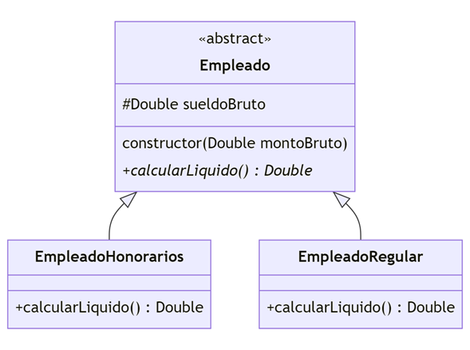

# Liquid Payment Calculator App

## Project Overview
This project is an Android application designed to calculate net payments for workers, with differentiation between two types of employees:
1. **Contractors** - with a retention rate of 13%.
2. **Regular Employees** - with a retention rate of 20%.

The app includes three main screens:
- **Main Menu**: A navigation menu to access each type of payment calculation.
- **Contractor Payment Calculator**: Calculates net payment for contractors.
- **Employee Payment Calculator**: Calculates net payment for regular employees.

## Technical Requirements

- **Jetpack Compose**: Used to create the Contractor Payment Calculator screen.
- **XML Views**: Used to create the Employee Payment Calculator screen.
- **Main Menu Screen**: Provides navigation buttons to access the two calculation screens.
- **Return Button**: Each calculation screen includes a button to return to the Main Menu.

## Features

- **Separate Retention Calculations**: Automatically applies the correct retention rate based on employee type.
- **Modern UI**: Combines Jetpack Compose and XML Views for a hybrid UI approach.
- **User-Friendly Navigation**: Easy-to-access buttons guide users through the app screens.

This repository will serve as a base for hands-on workshops in Android development.

## Data model

